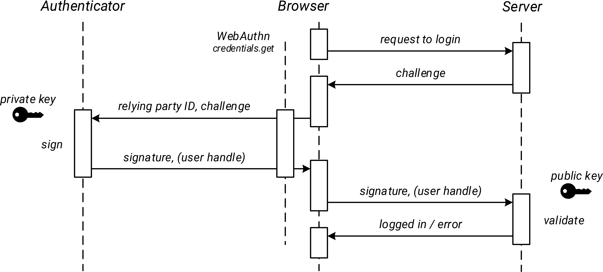

# Webauthn-Util

## Webauthn 이란?

Webauthn 이란, 비밀번호를 사용하지 않고 PassKey 인증을 기반으로 기기에 등록되어 있는 인증기를 통해 로그인 또는 인증을 진행하는 웹표준입니다.

비밀번호 인증은 대부분의 사람들에게 보편적이고 익숙한 방법이지만 일반적으로 하나의 사이트에서 사용하는 비밀번호를 다른 사이트에서도 동일하게 사용하므로 보안이 취약한 사이트에서 비밀번호가 탈취되거나, 피싱된 비밀번호로 인하여 타 사이트들에 보안 취약점이 발생하는 단점이 있습니다. 이러한 문제를 해결하기 위하여 2FA, MFA 등이 추가되었지만 이러한 방법 또한 사용자 입장에서 불필요한 절차를 진행하는 불편함을 겪게 됩니다.

Webauthn 은 이러한 기존 인증 방식의 문제점을 보완하여 고객 경험을 개선할 수 있습니다.

## Webauthn 흐름

Webauthn 의 역할은 크게 **인증등록**과 **인증검증** 2가지로 나눌 수 있습니다. 이 두가지 개념은 사실 Webauthn 이 아닌 다른 인증 절차에서도 동일하게 적용됩니다. 본인의 인증정보를 등록하고 등록된 인증정보를 기반으로 인증을 검증하는 것입니다.

하지만 Webauthn 은 Passkey 인증을 기반으로 한다는 점과 등록과 인증절차에 보안 강화를 위한 특별한 점들이 있는 것이 특징입니다.\


<figure><figcaption><p>webauthn 흐름</p></figcaption></figure>

#### **인증과정에서의 주체**

| 이름                                                             | 설명                                                                                                                                |
| -------------------------------------------------------------- | --------------------------------------------------------------------------------------------------------------------------------- |
| <mark style="color:blue;">사용자(User)</mark>                     | <p>인증 과정을 진행하는 인증 당사자 입니다.<br>지문, 얼굴, PIN 등의 다양한 인증 방법으로 인증을 진행합니다.</p>                                                           |
| <mark style="color:red;">인증기(Authenticator)</mark>             | <p>인증 정보를 생성하는 인증기 자체를 말합니다.<br>주로 device 자체를 말하거나 운영체제 또는 인증주체(FIDO, TPM), 인증수단을 뜻하기도합니다.</p>                                    |
| <mark style="color:yellow;">브라우저(Browser)</mark>               | <p>웹 브라우저 그 자체를 말합니다.<br>사용자의 요청을 서버에 전달하여 webauthn 인증 사양을 받고, 인증기에 인증을 요청합니다.</p>                                                |
| <mark style="color:green;">서버(RelyingParty, RP, Server)</mark> | <p>인증 요청을 받는 서버를 말하며 Webauthn Util 프로젝트가 사용되는 곳이기도 합니다.<br>서버는 인증기를 통하여 생성된 인증정보를 브라우저에서 전달받아 저장하고, 저장된 인증정보로 사용자의 인증을 승인합니다.</p> |

#### **인증등록**

1. <mark style="color:blue;">사용자</mark>가 **인증등록**을 위해 \*브라우저를통해 \*서버에 challenge 및 서버 사양(option)을 요청합니다.
2. \*서버는 랜덤으로 생성한 challenge, Webauthn 사양을 \*브라우저에게 응답합니다.
3. \*브라우저는 \*서버에서 받은 Webauthn 사양, challenge 를 \*인증기에 전달합니다.
4. \*인증기는 \*사용자가 선택한 인증방법으로 생성한 공개키를 \*브라우저를통해 \*서버로 전송합니다.
5. \*서버는 \*브라우저에가 전송한 공개키 정보들에서 challenge, rpId 등을 검증 후 \*서버에 저장합니다.

#### 인증검증

1. \*사용자가 **인증검증**을 위해 \*브라우저를통해 \*서버에 challenge 및 서버 사양(option)을 요청합니다.
2. \*서버는 랜덤으로 생성한 challenge, Webauthn 사양을 \*브라우저에게 응답합니다.
3. \*브라우저는 \*서버에서 받은 Webauthn 사양, challenge 를 \*인증기에 전달합니다.
4. \*인증기는 \*사용자가 선택한 인증방법으로 \*사용자를 검증하여 암호화된 데이터를 \*브라우저를통해 \*서버로 전송합니다.
5. \*서버는 \*브라우저에서 전송한 암호화 데이터를 \*서버에 저장된 공개키로 검증합니다.

#### 브라우저 소스 예제

Webauthn 을 사용하기 위해서 브라우저에서 아래 코드를 사용하여 **인증등록**을 위한 **자격증명생성**과 **인증검증**을 위한 **자격증명검증**을 진행합니다.\


#### **인증등록**

```javascript
async function createCrednetial() {
  // 서버 옵션 요청
  const res = await fetch("/createCredential/option");
  const serverOptions = await res.json();

  /* 서버에서 받은 serverOptions base64 url-safe decode
  ...
   */
  
  // 자격증명생성(지문, 얼굴, PIN, NFC, Bluetooth, USB 등의 인증이 일어남)
  const credential = navigator.credentials.create(serverOptions);
  
  /* 생성된 credential base64 url-safe encode
  ...
   */
  
  // 생성된 credential 서버에 등록 요청
  fetch("/createCredential", {
    method : "POST",
    headers : {
      "Content-Type" : "application/json",
    },
    body: JSON.stringify(credential),
  })
}
```

**인증검증**

```javascript
async function createCrednetial() {
  // 서버 옵션 요청
  const res = await fetch("/verifyCredential/option");
  const serverOptions = await res.json();

  /* 서버에서 받은 serverOptions base64 url-safe decode
  ...
   */
  
  // 자격증명생성(지문, 얼굴, PIN, NFC, Bluetooth, USB 등의 인증이 일어남)
  const credential = navigator.credentials.get(serverOptions);
  
  /* 생성된 credential base64 url-safe encode
  ...
   */
  
  // 생성된 credential 서버에 검증 요청
  fetch("/verifyCredential", {
    method : "POST",
    headers : {
      "Content-Type" : "application/json",
    },
    body: JSON.stringify(credential),
  })
}
```

### Webauthn 데이터 규격

#### 자격증명생성 serverOptions

navigator.credentials.create 함수의 파라미터를 json 규격으로 시각화 한 데이터입니다.

```json
{
  "publicKey": {
    "user": {
      "name": "...",
      "id": "ArrayBuffer",
      "displayName": "..."
    },
    "rp": {
      "rpId": "...",
      "rpName": "..."
    },
    "challenge": "ArrayBuffer",
    "timeout": "...",
    "attestation": "...",
    "pubKeyCredParams": [
      {
        "type": "public-key",
        "id": "..."
      }
    ],
    "authenticatorSelection": {
      "authenticatorAttachment": "...",
      "requireResidentKey": "...",
      "residentKey": "...",
      "userVerification": "..."
    },
    "extensions": {
      "uvm": "..."
    },
    "excludeCredentials": [
      {
        "type": "public-key",
        "id": "ArrayBuffer"
      }
    ]
  }
}
```

* user: 현재 인증을 하는 사용자의 정보가 담겨있습니다.
  * name: 서버에서 사용하는 사용자를 구분하는 키를 넣는 부분입니다.
  * id: 서버에서 사용하는 사용자를 구분하는 키를 base64로 encode 한 값입니다.
  * displayName: 서버에서 사용자가 웹 화면에서 볼 사용자의 구분값입니다.
* rp
  * rpId: 서버의 독자적인 키값이 담겨있습니다. 주로 서버의 도메인을 사용합니다.
  * rpName: 서버 또는 서비스 또는 도메인의 이름 또는 별칭이 담겨있습니다.
* challenge: 서버에서 클라이언트에게 랜덤하게 생성한 byte\[]가 담겨있습니다.\
  브라우저에서 이 값을 공개키를 만들 떄 사용하여 서버측에 다시 전송하고 서버측은 이 값이 서버측에서 보낸 challenge 와 동일한지 검증합니다.
* timeout: 서버측에서 클라이언트의 응답을 기다리는 최대 대기시간입니다.
* attestation: 인증기의 신뢰성을 결정하는 사양입니다. none, indirect, direct, enterprise 4개의 값중 한개의 값이 담겨있습니다.
  * none: 인증기의 신뢰성 또는 진위를 확인하지 않아도 될경우입니다.
  * indirect: 인증기의 신뢰성을 부분적으로 검증할경우 사용합니다.
  * direct: 인증기의 신뢰성을 완전 검증할 경우 사용합니다.
  * enterprise: 기업 환경에서 특수목적으로 너부 정책등을 반영하여 인증기의 신뢰성을 검증할 때 사용합니다.
* pubKeyCredParams: 서버측에서 사용하고있는 공개키 암호화 알고리즘이 담겨있는 배열입니다.
  * type: 현재는 "public-key"값으로 고정입니다.
  * id: [COSEAlg](https://www.iana.org/assignments/cose/cose.xhtml) 값이 담겨있습니다.
* authenticatorSelection: 서버측의 인증 사용 가이드가 담겨있습니다.
  * authenticatorAttachment: 인증기가 어떠한 인증 방식을 사용하도록 권장할지의 대한 값이 담겨있습니다. platform, cross-platform 2개의 값중 한개의 값이 담겨있습니다.
    * platform: 플랫폼에 내장된 인증기를 사용하도록 권장합니다.(지문인식, 얼굴인식 등)
    * cross-platform: 외부 인증기 사용을 권장합니다.(USB, NFC, Bluetooth 등)
  * requireResidentKey: 인증기가 생성한 자격증명이 어디에 저장될지를 결정하는 값이 담겨있습니다.
    * discouraged: 인증기가 생성한 자격증명이 서버에 저장되도록 권장합니다.
    * preferred: 인증기가 생성한 자격증명이 반드시 서버에 저장되는것은 아니지만 권장합니다.
    * required: 인증기가 생성한 자격증명이 인증기 자체에 반드시 저장되어야하합니다.
  * residentKey: Resident Credential 또는 Discoverable Credential 을 지원할지 여부를 지정합니다. requireResidentKey 와 비슷하지만 다르며 requireResidentKey 가 과거의 사용하던 방식입니다.\
    Resident Credential: 인증기가 생성한 자격 증명(credential)이 인증기 자체에 저장됩니다. 즉, 인증기가 자격 증명을 로컬에 저장하고, 사용자나 서버가 명시적으로 자격 증명을 전달하지 않더라도 인증기가 내부적으로 자격 증명을 관리할 수 있습니다.\
    Non-Resident Credential: 자격 증명이 인증기에 저장되지 않고, 서버에서 자격 증명의 ID(credentialId)를 저장하고 관리합니다. 인증기는 서버에서 제공한 자격 증명 ID를 사용하여 자격 증명을 선택하고 서명합니다.
    * discouraged: Resident Credential 을 사용하지 않도록 권장.
    * preferred: Resident Credential 을 사용할 수 있으면 사용하지만, 필수는 아님.
    * required: 반드시 Resident Credential 을 사용해야 함.
  * userVerification: 인증 장치에서 사용자 확인(예: 생체 인증, PIN 입력 등)이 필요한지 여부가 담겨있습니다.
    * required: 사용자 인증이 반드시 필요합니다.
    * preferred: 사용자 인증이 가능한 경우 이를 사용하지만, 필수는 아닙니다.
    * discouraged: 용자 인증을 사용하지 않도록 권장합니다. (즉, 자격 증명을 사용하되 사용자 검증을 생략할 수 있습니다.)
  * extensions: 확장을 위해 사용되는 값들이 담겨있습니다. 이 값은 필수가 아닌 선택(옵션)적 값입니다.
    * uvm: 증 장치가 사용자 인증을 위해 어떤 방식을 사용했는지 정보를 제공하는 확장입니다. 예를 들어, 지문 인식이나 얼굴 인식 같은 방법을 사용했는지 여부를 서버에서 확인할 수 있습니다.
  * excludeCredentials: 사용자에 등록된 webauthn 인증기의 credentialId 값이 배열로 들어있습니다.
    * type: 현재는 "public-key"값으로 고정입니다.
    * id: 등록된 인증기의 credentialId가 담겨있습니다.

#### 인증기가 생성한 Credential

navigator.credentials.create 함수의 결과를 json 규격으로 시각화 한 데이터입니다.

```json
{
  "authenticatorAttachment": "...",
  "id": "base64 url-safe encoded",
  "rawId": "ArrayBuffer",
  "response": {
    "attestationObject": "ArrayBuffer",
    "clientDataJSON": "ArrayBuffer",
    "type": "..."
  }
}
```

* authenticatorAttachment: 인증기가 어떠한 인증 방식을 사용하였는지의 대한 값이 담겨있습니다. platform, cross-platform 2개의 값중 한개의 값이 담겨있습니다.
  * platform: 플랫폼에 내장된 인증기를 사용하였습니다.(지문인식, 얼굴인식 등)
  * cross-platform: 외부 인증기 사용하였습니다.(USB, NFC, Bluetooth 등)
* id: 인증기에서 생성한 고유한 Id 입니다, credentialId 라는 대체어로 주로 사용됩니다.. base64형식으로 인코딩되어있습니다.
* rawId: credentialId의 원본값입니다.
* response: 클라이언트에서 생성한 자격 증명에 대한 응답 객체(response)입니다.
  * attestationObject:
    * fmt: Attestation 의 형식을 나타냅니다.(packed, fido-u2f, tpm, android-key, apple)
    * attStmt: Attestation 서명 정보입니다. 여기에는 서명(sig)과, 필요에 따라 인증서(x5c)가 포함됩니다.\
      서명값을 사용하여 인증서를 검증해 인증기의 신뢰성을 검사하는걸 권장하고있습니다. 여기서에 서명과 인증서는 Webauthn 공개키와는 연관이없습니다.
    * authData: 인증기에서 생성한 서명정보가 포함되어있습니다. byte\[] 형식으로 저장되어있으며 정해진 길이에 따라 파싱할 수있습니다.
      * rpIdHash: 0\~31까지 32개의 바이트 배열로 구성되어있습니다. 서버에서 전달한 옵션중 rpId를 해싱한 값입니다.\
        서버에서는 서버에서 전달한 rpId와 일치하는지 검증합니다.
      * flag: 32\~32까지 1개의 바이트로 구성되어있습니다. 각종 flag(여부) 값들이 담겨있습니다.
        * userPresent: 인증기가 사용자의 존재를 확인했다는 플래그입니다. 인증의 여부와 상관은 없습니다.
        * userVerified: 인증기가 사용자의 인증을 하여 확인했다는 플래그입니다. 지문인식, 얼굴인식, 핀, 또다른 생체 인식 등을 사용하여 인증을 하였슴을 의미합니다.
        * attestedCredentialDataIncluded: 공개키 정보를 담고있는지 의 대한 여부입니다. 인증등록 시 에만 참입니다.
        * extensionsDataIncluded: 인증기에서 확장데이터를 보냈는지의 대한 여부입니다.
      * counter: 33\~36까지 4개의 바이트로 구성되어있습니다. 인증기에 현재 인증 횟수가 담겨있습니다. 등록시에는 0이 담겨있으며 검증시에는 인증기에서 서명데이터를 보낼 때 마다 1을 증가하여 보냅니다.\
        서버는 카운터 값을 등록 및 검증 시마다 서버에 저장하고, 검증시 검증횟수가 서버에있는 검증 횟수보다 많은지 비교하여 정상적인 검증 정보인지 검증합니다. 일부 인증기에서는 항상 0으로 보내기도 하여 반드시 검증해야하는 부분은 아닙니다.
      * aaguid: 37\~52까지 16개의 바이트로 구성되어있습니다. 인증기의 고유한 ID 값이 담겨있습니다.
      * credentialIdLength: 53\~54까지 2개의 바이트로 구성되어있습니다. credentialId 의 길이가 담겨있습니다.
      * credentialId: credentialIdLength 만큼에 바이트로 구성되어있습니다. 인증기에서 생성한 인증정보의 고유한 ID 입니다. 서버에서의 인증 정보의 UID 처럼 활용됩니다.
      * coseKeyBytes: 남은 모든 길이만큼의 바이트로 구성되어있습니다. 인증기에서 생성한 공개키 정보가 담겨있습니다.\
        서버에서는 이 정보를 저장하고 인증검증시 들어오는 서명값을 공개키로 검증하여야합니다.
    * clientDataJSON: JSON 형식의 문자열을 byte\[]로 담겨있습니다. URL 인코딩 후 JSON 파싱하여 정보를 취득합니다.
      * type: 요청의 유형.(인증생성일경우: webauthn.create, 인증검증일경우: webauthn.get)
      * challenge: 서버에서 제공한 challenge 값입니다. 서버에서 제공한값과 일치하는지 검증이 필요합니다.
      * origin: 웹 사이트의 origin(예: https://example.com)으로, 요청이 올바른 출처에서 이루어졌는지 확인할 수 있습니다.
      * crossOrigin: 요청이 다른 출처에서 이루어졌는지를 나타냅니다.(origin 의 반대값입니다)

#### 자격증명검증 serverOptions

navigator.credentials.get 함수의 파라미터를 json 규격으로 시각화 한 데이터입니다.

```json
{
  "rpId": "base64 url-safe encoded",
  "challenge": "ArrayBuffer",
  "timeout": "...",
  "type": "public-key",
  "allowCredentials": {
    "type": "...",
    "id": "ArrayBuffer"
  }
}
```

* rpId: 서버의 독자적인 키값이 담겨있습니다. 주로 서버의 도메인을 사용합니다.
* challenge: 서버에서 클라이언트에게 랜덤하게 생성한 byte\[]가 담겨있습니다.
* timeout: 서버측에서 클라이언트의 응답을 기다리는 최대 대기시간입니다.
* type: 현재는 "public-key"값으로 고정입니다.
* allowCredentials: 인증 가능한 자격 증명 목록입니다.
  * type: 현재는 "public-key"값으로 고정입니다.
  * id: 등록된 인증기의 credentialId가 담겨있습니다.

#### 인증기가 검증한 Credential

navigator.credentials.create 함수의 결과를 json 규격으로 시각화 한 데이터입니다.

```json
{
  "id": "base64 url-safe encoded",
  "rawId": "ArrayBuffer",
  "response": {
    "authenticatorData": "ArrayBuffer",
    "clientDataJSON": "ArrayBuffer",
    "signature": "ArrayBuffer",
    "userHandle": "ArrayBuffer"
  },
  "type": ""
}
```

* id: 인증기에서 생성한 고유한 Id 입니다, credentialId 라는 대체어로 주로 사용됩니다.. base64형식으로 인코딩되어있습니다.
* rawId: credentialId의 원본값입니다.
* response: 클라이언트에서 검증한 자격 증명에 대한 응답 객체(response)입니다.
  * authenticatorData: 인증 정보가 담겨있는 데이터입니다. byte\[] 형식으로 저장되어있으며 정해진 길이에 따라 파싱할 수있습니다.
    * rpIdHash: 0\~31까지 32개의 바이트 배열로 구성되어있습니다. 서버에서 전달한 옵션중 rpId를 해싱한 값입니다.\
      서버에서는 서버에서 전달한 rpId와 일치하는지 검증합니다.
    * flag: 32\~32까지 1개의 바이트로 구성되어있습니다. 각종 flag(여부) 값들이 담겨있습니다.
      * userPresent: 인증기가 사용자의 존재를 확인했다는 플래그입니다. 인증의 여부와 상관은 없습니다.
      * userVerified: 인증기가 사용자의 인증을 하여 확인했다는 플래그입니다. 지문인식, 얼굴인식, 핀, 또다른 생체 인식 등을 사용하여 인증을 하였슴을 의미합니다.
      * attestedCredentialDataIncluded: 공개키 정보를 담고있는지 의 대한 여부입니다. 인증등록 시 에만 참입니다.
      * extensionsDataIncluded: 인증기에서 확장데이터를 보냈는지의 대한 여부입니다.
    * counter: 33\~36까지 4개의 바이트로 구성되어있습니다. 인증기에 현재 인증 횟수가 담겨있습니다. 등록시에는 0이 담겨있으며 검증시에는 인증기에서 서명데이터를 보낼 때 마다 1을 증가하여 보냅니다.\
      서버는 카운터 값을 등록 및 검증 시마다 서버에 저장하고, 검증시 검증횟수가 서버에있는 검증 횟수보다 많은지 비교하여 정상적인 검증 정보인지 검증합니다. 일부 인증기에서는 항상 0으로 보내기도 하여 반드시 검증해야하는 부분은 아닙니다.
  * clientDataJSON: JSON 형식의 문자열을 byte\[]로 담겨있습니다. URL 인코딩 후 JSON 파싱하여 정보를 취득합니다.
    * type: 요청의 유형.(인증생성일경우: webauthn.create, 인증검증일경우: webauthn.get)
    * challenge: 서버에서 제공한 challenge 값입니다. 서버에서 제공한값과 일치하는지 검증이 필요합니다.
    * origin: 웹 사이트의 origin(예: https://example.com)으로, 요청이 올바른 출처에서 이루어졌는지 확인할 수 있습니다.
    * crossOrigin: 요청이 다른 출처에서 이루어졌는지를 나타냅니다.(origin 의 반대값입니다)
    * signature: 인증기에서 clientDataJSON 과 authenticatorData 를 서명한 값입니다.\
      서버는 저장되어있는 공개키로 서명값을 검증하여 인증검증을 진행합니다.
  * userHandle: 선택적인 값으로, 등록시 전송한 user 의 id 가 base64Url 로 인코딩되어있습니다. 사용자에 관한 식별 정보를 추가로 제공할 때 사용합니다.
* type: 현재는 "public-key"값으로 고정입니다.
